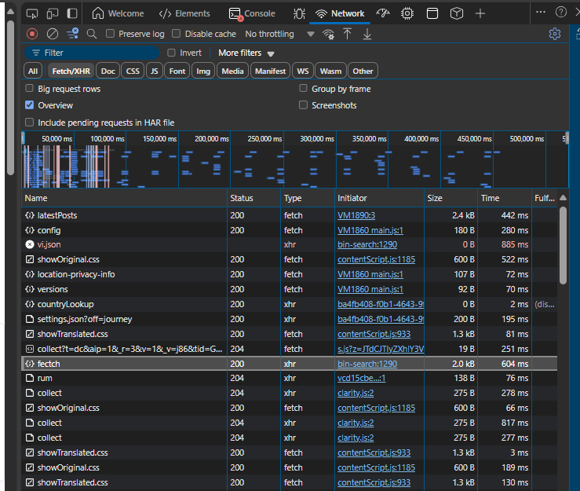
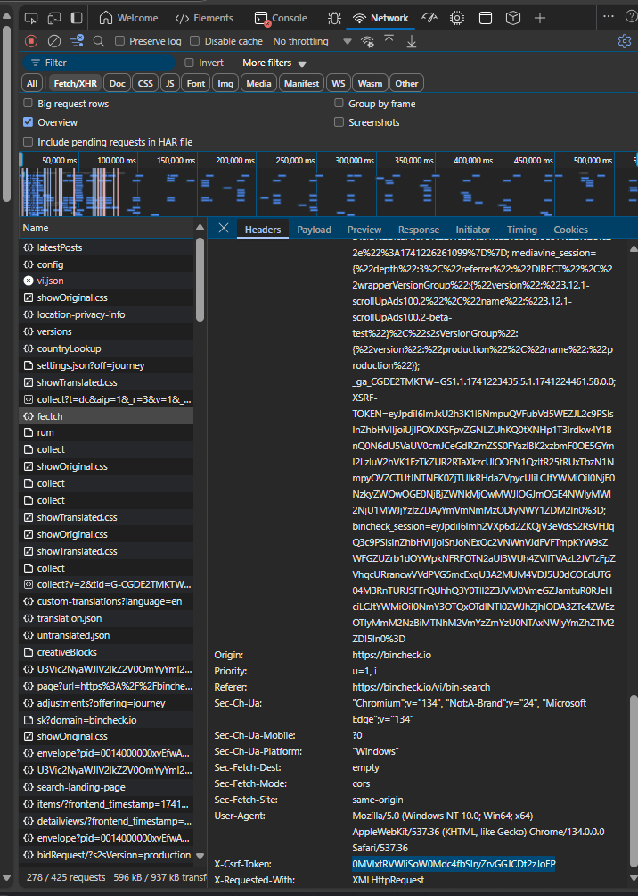
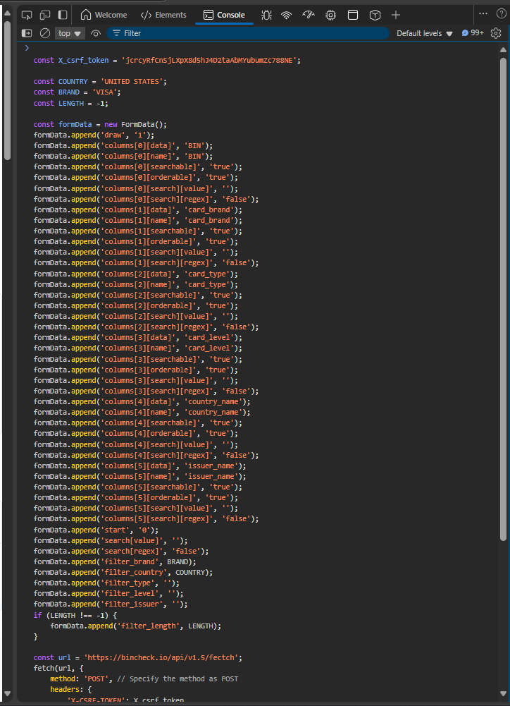
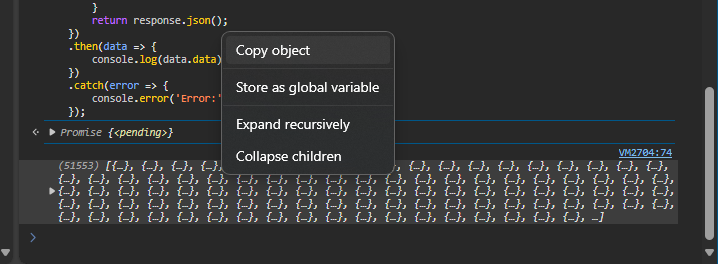

## Cài đặt

-   Cài đặt `python`
-   Thực thi `script` sau để cài đặt các thư viện cần thiết

```bash
pip install -r requirements.txt
```

## Lấy data

-   Truy cập vào trang web: [Bincheck.io](https://bincheck.io/vi/bin-search)
-   `F12` -> `Network` -> `FETCH/XHR`



-   Tìm request có tên `fetch` và copy `x-csrf-token`



Chỉnh sửa file `config.yaml`, với các thông số sau:

-   `csrf_token`: `x-csrf-token` đã copy
-   `country`: tên quốc gia của thẻ
-   `length`: số lượng data cần lấy,

```yaml
csrf_token: 0MVIxtRVWliSoW0Mdc4fbSIryZrvGGJCDt2zJoFP
country: UNITED STATES
brand: VISA
length: -1
```

-   Chạy lệnh sau để lấy data: 

> Sau khi chạy xong, script lấy data sẽ được lưu vào `clipboard`

```bash
python getData.py
```

-   Try cấp lại vào trang web [Bincheck.io](https://bincheck.io/vi/bin-search) và vào tab `Console`, paste đoạn `script` vừa lấy được vào và chạy



-  Copy data vừa lấy được, paste vào file `data.json` để lưu lại



## Chạy chương trình

Chỉnh sửa file `config.yaml` với các thông số sau:

-   `file_path`: đường dẫn file `data.json` vừa lấy được
-   `output_file_path`: đường dẫn file output
-   `num_threads`: số lượng `thread` cần chạy
-   `url`: url để lấy thông tin thẻ (không cần chỉnh sửa)
-   `country_code`: mã quốc gia (840: UNITED STATES)
-   `proxy`: proxy để chạy
-   `proxy_user`: user của proxy
-   `proxy_pass`: pass của proxy
-   `retry_after`: thời gian chờ sau khi bị block bởi server do gọi request quá nhiều
-   `offset`: vị trí bắt đầu
-   `limit`: số lượng data cần kiểm tra

```yaml
file_path: us.json
output_file_path: output.csv

num_threads: 3
url: https://purchasealerts.visa.com/pas/apps/7d955368-76f3-4862-410a-18d406710101/issuerOptStatus
country_code: 840
proxy: 45.43.167.67:6249
proxy_user: lsakekat
proxy_pass: cx1jzxzb2o5k
retry_after: 5
offset: 416
limit: 1000
```

-   Chạy lệnh sau để chạy chương trình:

```bash
python main.py
```